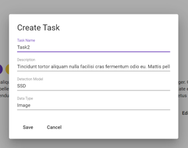
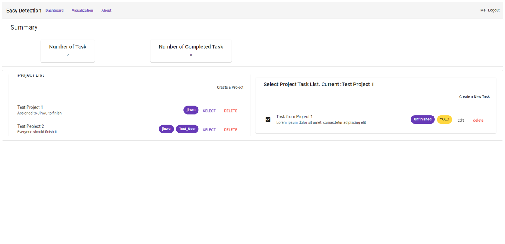

<!-- Improved compatibility of back to top link: See: https://github.com/othneildrew/Best-README-Template/pull/73 -->
<a name="readme-top"></a>
<!--
*** Thanks for checking out the Best-README-Template. If you have a suggestion
*** that would make this better, please fork the repo and create a pull request
*** or simply open an issue with the tag "enhancement".
*** Don't forget to give the project a star!
*** Thanks again! Now go create something AMAZING! :D
-->


<!-- PROJECT SHIELDS -->
<!--
*** I'm using markdown "reference style" links for readability.
*** Reference links are enclosed in brackets [ ] instead of parentheses ( ).
*** See the bottom of this document for the declaration of the reference variables
*** for contributors-url, forks-url, etc. This is an optional, concise syntax you may use.
*** https://www.markdownguide.org/basic-syntax/#reference-style-links
-->


<!-- PROJECT LOGO -->
<br />
<div align="center">

  <h3 align="center">CNIT581 Web Development</h3>

  <p align="center">
    Project
    <br />
    <a href="https://github.com/xiaojinwu/CNIT581_term_project"><strong>Explore the docs »</strong></a>
    <br />
    <br />
    <a href="https://github.com/xiaojinwu/CNIT581_term_project">View Demo</a>
    ·
    <a href="https://github.com/xiaojinwu/CNIT581_term_project">Report Bug</a>
    ·
    <a href="https://github.com/xiaojinwu/CNIT581_term_project">Request Feature</a>
  </p>
</div>


<!-- TABLE OF CONTENTS -->
<details>
  <summary>Table of Contents</summary>
  <ol>
    <li>
      <a href="#about-the-project">About The Project</a>
      <ul>
        <li><a href="#built-with">Built With</a></li>
      </ul>
    </li>
    <li>
      <a href="#getting-started">Getting Started</a>
      <ul>
        <li><a href="#prerequisites">Prerequisites</a></li>
        <li><a href="#installation">Installation</a></li>
      </ul>
    </li>
    <li><a href="#usage">Usage</a></li>
    <li><a href="#license">License</a></li>
    <li><a href="#contact">Contact</a></li>
    <li><a href="#References">References</a></li>
  </ol>
</details>


<!-- ABOUT THE PROJECT -->
## About The Project

This project implements a basic task management view with a user authorization framework. The website allows users to easily view and manage their tasks. The core functions of task management include viewing, editing, deleting, and creating tasks.
<br />

The potential user groups are still the same users who need to use the visual algorithm as mentioned in the previous project, but at this stage the web page only provides users to create task models.
The website provides a good authorization login interface so that users can ensure the privacy of their data to a certain extent.
<br />

The intended audience of the platform can be divided into three types: 
The first one is the engineering user. Engineering users are those who directly use various target detection models to detect video or images in their projects and want to get results. The focus of this group of users is on the use of the models and the acquisition of results.
The second type of user is the model researcher, who can upload their own models for use by engineering users through the platform and get some benefits from engineering users whenever their models are used.
The third type of user is project managers and collaborators.

<p align="center" >
    Login
</p>
<div align="center">
  
</div>

<br />
<br />

<p align="center" >
    Create Project
</p>
<div align="center">
  
</div>

<br />
<br />

<p align="center" >
    Create Task
</p>
<div align="center">
  
</div>

The main functions of the platform are divided into two parts. The first part is project task management, and the second part is visualization. In the project task management we designed the project entities for the user to easily implement the tasks in the hierarchy. The user can assign the corresponding developer to the project and the tasks to be performed. The visualization interface is mainly used to show the results of data processing.




On the dashboard page we have designed a left and right column for a quick view of the tasks contained in the corresponding project, thus enabling an example of data interaction.The user can select the corresponding project by using the select button on the left side and the tasks under that project will be loaded automatically in the right-hand sub-bar.


In the visualization we have implemented the ability to access the list of resources from an external API and interact with the external SDK components provided by the Cesium ION API.

<p align="right">(<a href="#readme-top">back to top</a>)</p>


### Built With

This section should list any major frameworks/libraries used to bootstrap your project. Leave any add-ons/plugins for the acknowledgements section. Here are a few examples.
* [[CesiumJS](https://cesium.com/cesiumjs/)]
* [](https://www.djangoproject.com/)
* [![Material Design ][Material_Design]][Material-url]
* [![Angular][Angular.io]][Angular-url]


<p align="right">(<a href="#readme-top">back to top</a>)</p>


<!-- GETTING STARTED -->
## Getting Started

This is instructions for how to set up the project locally.
To get a local copy up and running follow these simple example steps.

### Prerequisites

#### Backend
* Create a virtual Environment with python 3.9 in Anaconda.
* npm
  ```sh
  pip install djangorestframework django-cors-headers django_api_admin
  ```
* run server side
  ```sh
  pip python ./manage.py runserver
  ```

#### Myapp
1. install node.js https://nodejs.org/en/
2. install Yarn(Package Manager): https://classic.yarnpkg.com/lang/en/docs/install/#windows-stable
3. restore the libs: Execute  yarn command in terminal. 
4. start App: Execute yarn start

### Installation

_Below is demo of how you can install and set up the app._

1. Clone the repo
   ```sh
   git clone https://github.com/xiaojinwu/CNIT581_term_project.git
   ```
2. Install NPM packages
   ```sh
   npm install
   ```
<p align="right">(<a href="#readme-top">back to top</a>)</p>


<!-- USAGE EXAMPLES -->
## Usage

live demo: http://cnit581demo.jinwu.me/

url for local server: http://127.0.0.1:8000

Api of task: http://127.0.0.1:8000/myapp/task/


<p align="right">(<a href="#readme-top">back to top</a>)</p>

<!-- LICENSE -->
## License

Distributed under the CNIT581 License. 

<p align="right">(<a href="#readme-top">back to top</a>)</p>


<!-- CONTACT -->
## Contact

Jinwu Xiao - [xiao270@purdue.edu](xiao270@purdue.edu)

Hang Li - [li4016@purdue.edu](li4016@purdue.edu)

Project Link: [https://github.com/xiaojinwu/CNIT581_term_project](https://github.com/xiaojinwu/CNIT581_term_project)

<p align="right">(<a href="#readme-top">back to top</a>)</p>


<!-- ACKNOWLEDGMENTS -->
## References

* [Angular](https://angular.io/)
* [Material Design](https://m3.material.io/)
* [Angular Material](https://material.angular.io/)
* [Django REST framework](https://www.django-rest-framework.org/)

<p align="right">(<a href="#readme-top">back to top</a>)</p>


<!-- MARKDOWN LINKS & IMAGES -->
<!-- https://www.markdownguide.org/basic-syntax/#reference-style-links -->
[contributors-shield]: https://img.shields.io/github/contributors/othneildrew/Best-README-Template.svg?style=for-the-badge
[contributors-url]: https://github.com/othneildrew/Best-README-Template/graphs/contributors
[forks-shield]: https://img.shields.io/github/forks/othneildrew/Best-README-Template.svg?style=for-the-badge
[forks-url]: https://github.com/othneildrew/Best-README-Template/network/members
[stars-shield]: https://img.shields.io/github/stars/othneildrew/Best-README-Template.svg?style=for-the-badge
[stars-url]: https://github.com/othneildrew/Best-README-Template/stargazers
[issues-shield]: https://img.shields.io/github/issues/othneildrew/Best-README-Template.svg?style=for-the-badge
[issues-url]: https://github.com/othneildrew/Best-README-Template/issues
[license-shield]: https://img.shields.io/github/license/othneildrew/Best-README-Template.svg?style=for-the-badge
[license-url]: https://github.com/othneildrew/Best-README-Template/blob/master/LICENSE.txt
[linkedin-shield]: https://img.shields.io/badge/-LinkedIn-black.svg?style=for-the-badge&logo=linkedin&colorB=555
[linkedin-url]: https://linkedin.com/in/othneildrew
[product-screenshot]: images/screenshot.png

[React.js]: https://img.shields.io/badge/React-20232A?style=for-the-badge&logo=react&logoColor=61DAFB
[React-url]: https://reactjs.org/

[Angular.io]: https://img.shields.io/badge/Angular-DD0031?style=for-the-badge&logo=angular&logoColor=white
[Angular-url]: https://angular.io/
[Material_Design]: https://img.shields.io/badge/-Material%20Design-brightgreen
[Material-url]: https://m3.material.io/


[Bootstrap.com]: https://img.shields.io/badge/Bootstrap-563D7C?style=for-the-badge&logo=bootstrap&logoColor=white
[Bootstrap-url]: https://getbootstrap.com
[JQuery.com]: https://img.shields.io/badge/jQuery-0769AD?style=for-the-badge&logo=jquery&logoColor=white
[JQuery-url]: https://jquery.com 

[Djiango]: https://img.shields.io/badge/Django-092E20?style=for-the-badge&logo=django&logoColor=green
[Django-url]: https://www.djangoproject.com/

[Cesium]: https://img.shields.io/badge/Cesium-092E20?style=for-the-badge&logo=cesium&logoColor=green
[Cesium-url]: https://cesium.com/
